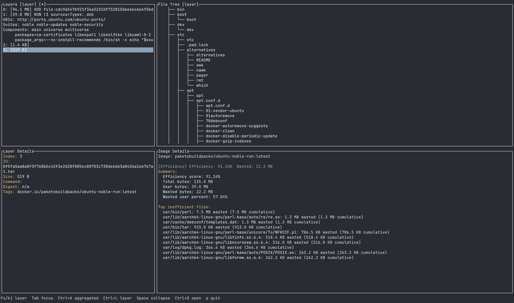
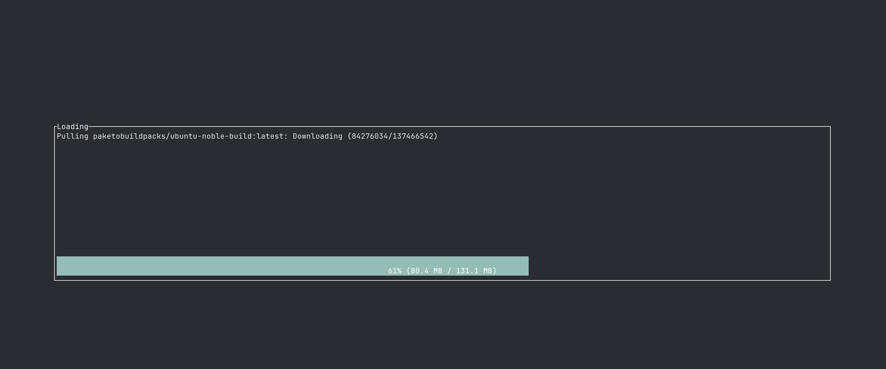

# deep-dive

A fast, terminal-based explorer for Docker and OCI image layers.

`deep-dive` shows you exactly what changed in each layer of a container image,
how much space was used, and where bytes are wasted. It is a Rust rewrite of
[Wagoodman's `dive`](https://github.com/wagoodman/dive), rebuilt with
[`ratatui`](https://github.com/ratatui/ratatui) for a modern immediate-mode UI.

## Features

- **Multiple image sources** — analyze images from Docker daemon, Podman, OCI
  registries, local `docker save` tar files, or OCI layout directories.
- **Layer-by-layer file tree** — browse the filesystem as it appears after each
  layer, with changes color-coded by type.
- **Compare modes** — view each layer's natural changes or the cumulative
  aggregated view from the base image.
- **Efficiency analysis** — discover wasted bytes from duplicated files and
  whiteout deletions.
- **Layer stats** — inspect per-layer size, unique size, compression, and file
  counts.
- **Shaded file detection** — find files hidden by newer versions in upper
  layers.
- **Keyboard-driven** — navigate the entire UI without a mouse.

## Installation

### Homebrew (macOS / Linux)

```bash
brew install dmikusa/tap/deep-dive
```

### Pre-built binaries

Download the latest release for your platform from the
[GitHub Releases page](https://github.com/dmikusa/deep-dive/releases).

Available targets:

- `aarch64-apple-darwin` (Apple Silicon macOS)
- `x86_64-apple-darwin` (Intel macOS)
- `aarch64-unknown-linux-gnu` (ARM64 Linux)
- `x86_64-unknown-linux-gnu` (x86_64 Linux)
- `x86_64-pc-windows-msvc` (Windows)

Extract the archive and place the `deep-dive` binary on your `PATH`.

### Build from source

```bash
# Clone the repository
git clone https://github.com/dmikusa/deep-dive.git
cd deep-dive

# Build release binary
cargo build --release

# Binary will be at target/release/deep-dive
```

Requires a stable Rust toolchain (1.75+).

## Usage

Analyze an image by passing a URI with a scheme:

```bash
# Local Docker save tar
deep-dive docker-archive://path/to/image.tar

# OCI layout directory (e.g. skopeo output)
deep-dive oci://path/to/oci-dir

# Local Docker daemon
deep-dive docker://ubuntu:latest

# Podman
deep-dive podman://fedora:latest

# OCI registry
deep-dive registry://alpine:latest
```

The image reference must always include a URI scheme; the source is inferred
from the scheme.

```
deep-dive [OPTIONS] <IMAGE>

Arguments:
  <IMAGE>  Image reference as a URI (scheme://...)

Options:
  -c, --config <FILE>  Config file path
  -v, --verbose...     Verbose logging
  -q, --quiet          Quiet mode (errors only)
  -h, --help           Print help
  -V, --version        Print version
```

### Configuration

`deep-dive` reads an optional YAML config file from:

1. `./deep-dive.yaml` in the current directory, or
2. `~/.config/deep-dive/config.yaml`

Example:

```yaml
compare_mode: natural        # natural | aggregated
show_attributes: false
wrap_tree: false
sort_mode: name              # name | size
keybindings:
  quit: ctrl+q
  filter: /
extract:
  default-directory: ~/Downloads/deep-dive-extracts
```

Keybindings are described by the action name. A key description uses the
format `ctrl+f`, `space`, `tab`, `shift+o`, etc.

## TUI Keybindings

The default keybindings are designed to match the original `dive` workflow.
All bindings can be overridden in the config file.

### General

| Key | Action |
| --- | --- |
| `q` / `Ctrl+c` | Quit |
| `Tab` | Move focus to next pane |
| `Shift+Tab` | Move focus to previous pane |
| `Ctrl+z` | Suspend to shell (Unix; resume with `fg`) |

### Layers pane

| Key | Action |
| --- | --- |
| `↑` / `↓` or `k` / `j` | Select previous / next layer |
| `Enter` / `Space` | Toggle collapse of selected directory |
| `Ctrl+Space` | Collapse all directories (or expand all if already collapsed) |
| `Ctrl+l` | Compare mode: natural |
| `Ctrl+a` | Compare mode: aggregated |

### File tree pane

| Key | Action |
| --- | --- |
| `↑` / `↓` or `k` / `j` | Select previous / next visible node |
| `←` / `h` | Collapse selected directory |
| `→` / `l` | Expand selected directory |
| `Enter` / `Space` | Toggle collapse of selected directory |
| `Ctrl+Space` | Collapse all / expand all |
| `u` / `d` | Page up / page down |
| `Ctrl+f` | Toggle regex filter |
| `Ctrl+e` | Extract selected file or symlink |
| `Ctrl+o` | Toggle sort mode (name / size) |
| `Ctrl+b` | Toggle file attributes display |
| `Ctrl+p` | Toggle tree wrapping |
| `Ctrl+a` | Toggle visibility of added files |
| `Ctrl+r` | Toggle visibility of removed files |
| `Ctrl+m` | Toggle visibility of modified files |
| `Ctrl+u` | Toggle visibility of unmodified files |

### Modals and filter

| Key | Action |
| --- | --- |
| `Esc` | Cancel modal / close filter |
| `Enter` | Confirm modal |
| `Backspace` | Delete character in modal/filter input |
| Any character | Type into modal/filter input |

### Open another image

| Key | Action |
| --- | --- |
| `Ctrl+o` (or `Cmd+o` on macOS) | Open the "Open image" dialog |

## Color legend

| Color | Meaning |
| --- | --- |
| Green | Added in the selected layer |
| Red | Removed in the selected layer |
| Yellow | Modified in the selected layer |
| Default | Unmodified |

## Image inspections

`deep-dive` runs analyzers against the parsed image and displays the results in
the Image Details pane. The analyzer framework is extensible; new inspections
can be added without changing the UI.

### Efficiency

The Efficiency analyzer measures how much space is wasted by file duplication
and deletions across layers.

- **Score** — ranges from 0% to 100%. 100% means every byte appears exactly
  once in the final image; lower scores mean more wasted space.
- **Wasted bytes** — the total bytes that exist in layer tars but are not
  needed in the final image.
- **Inefficiencies** — the top files that contribute to waste, such as:
  - A file that exists in multiple layers with different content (the older
    copies are wasted).
  - A file that was added in a lower layer and then deleted by a whiteout
    file in an upper layer.

For example, if `/usr/bin/app` is 10 MB in layer 3 and then overwritten by a
12 MB version in layer 7, the 10 MB from layer 3 counts as wasted space.

## Screenshots





## Development

```bash
# Build
cargo build

# Test
cargo test

# Lint
cargo clippy -- -D warnings

# Format
cargo fmt

# Coverage
mkdir -p target/coverage && cargo llvm-cov --lcov --output-path target/coverage/lcov.info
```

## License

Licensed under the Apache License, Version 2.0.
See [LICENSE](LICENSE) for details.

## Acknowledgements

Inspired by [dive](https://github.com/wagoodman/dive) by Alex Goodman.
