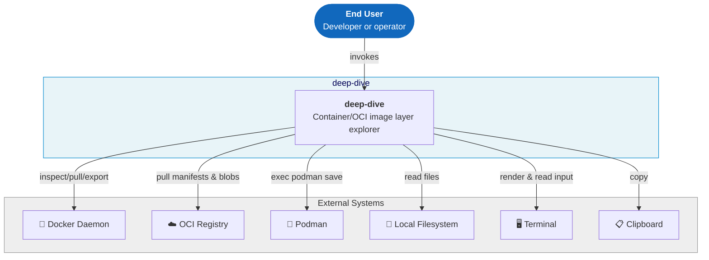
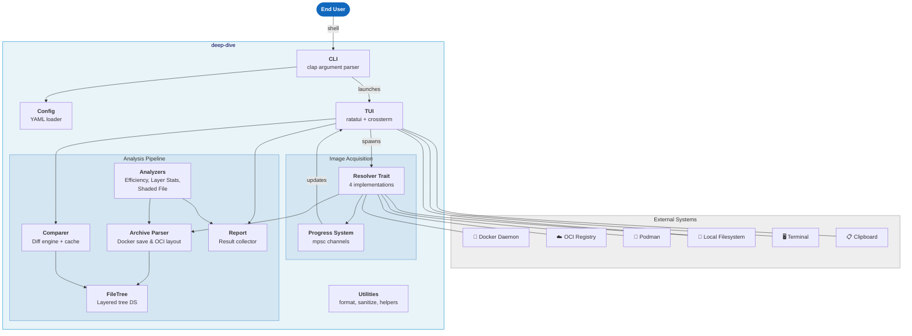
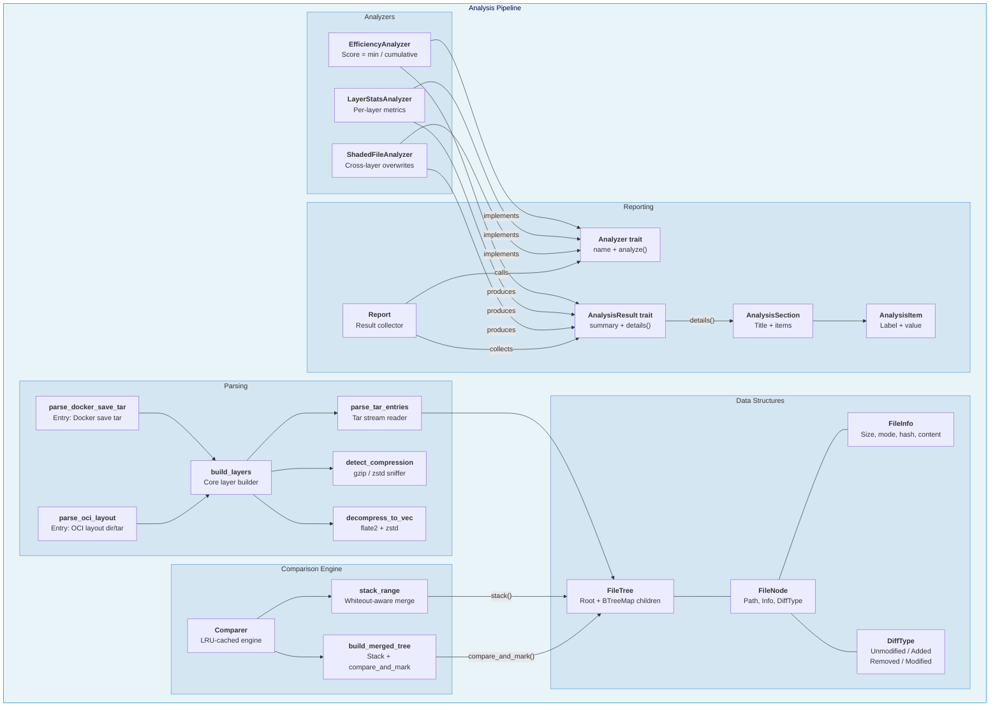

# Architecture (C4 Model)

## C1 — System Context

```mermaid
flowchart TB
  User(["<b>End User</b><br/>Developer or operator"])
  style User fill:#1168bd,color:#fff,stroke:#1168bd

  subgraph Ext["External Systems"]
    style Ext fill:#eee,stroke:#999,color:#333
    Docker["🐳 Docker Daemon"]
    Registry["☁️ OCI Registry"]
    Podman["🐧 Podman"]
    Fs["📁 Local Filesystem"]
    Term["🖥️ Terminal"]
    Clip["📋 Clipboard"]
  end

  subgraph Center["deep-dive"]
    style Center fill:#e8f4f8,stroke:#08c,color:#005
    DD["<b>deep-dive</b><br/>Container/OCI image layer explorer"]
  end

  User -->|"invokes"| DD
  DD -->|"inspect/pull/export"| Docker
  DD -->|"pull manifests & blobs"| Registry
  DD -->|"exec podman save"| Podman
  DD -->|"read files"| Fs
  DD -->|"render & read input"| Term
  DD -->|"copy"| Clip
```

## C2 — Containers

```mermaid
flowchart TB
  User(["<b>End User</b>"])
  style User fill:#1168bd,color:#fff,stroke:#1168bd

  subgraph Ext["External Systems"]
    style Ext fill:#eee,stroke:#999,color:#333
    Docker["🐳 Docker Daemon"]
    Registry["☁️ OCI Registry"]
    Podman["🐧 Podman"]
    Fs["📁 Local Filesystem"]
    Term["🖥️ Terminal"]
    Clip["📋 Clipboard"]
  end

  subgraph DD["deep-dive"]
    style DD fill:#e8f4f8,stroke:#08c,color:#005

    CLI["<b>CLI</b><br/>clap argument parser"]
    Cfg["<b>Config</b><br/>YAML loader"]
    TUI["<b>TUI</b><br/>ratatui + crossterm"]

    subgraph Acquire["Image Acquisition"]
      style Acquire fill:#d4e6f1,stroke:#5b9bd5
      Resolver["<b>Resolver Trait</b><br/>4 implementations"]
      Prog["<b>Progress System</b><br/>mpsc channels"]
    end

    subgraph Pipeline["Analysis Pipeline"]
      style Pipeline fill:#d4e6f1,stroke:#5b9bd5
      Parser["<b>Archive Parser</b><br/>Docker save & OCI layout"]
      FT["<b>FileTree</b><br/>Layered tree DS"]
      Comp["<b>Comparer</b><br/>Diff engine + cache"]
      An["<b>Analyzers</b><br/>Efficiency, Layer Stats,<br/>Shaded File"]
      Rpt["<b>Report</b><br/>Result collector"]
    end

    Utils["<b>Utilities</b><br/>format, sanitize, helpers"]
  end

  User -->|"shell"| CLI
  CLI --> Cfg
  CLI -->|"launches"| TUI
  TUI -->|"spawns"| Resolver
  TUI --> Comp
  TUI --> Rpt
  Resolver --> Prog
  Prog -->|"updates"| TUI
  Resolver --> Parser
  Parser --> FT
  Comp --> FT
  An --> Parser
  An --> Rpt
  Resolver --- Docker
  Resolver --- Registry
  Resolver --- Podman
  Resolver --- Fs
  TUI --- Term
  TUI --- Clip
  TUI --- Fs
```

## C3 — Components (Analysis Pipeline)

```mermaid
flowchart TB
  subgraph Pipeline["Analysis Pipeline"]
    style Pipeline fill:#e8f4f8,stroke:#08c,color:#005

    subgraph Parse["Parsing"]
      style Parse fill:#d4e6f1,stroke:#5b9bd5
      PD["<b>parse_docker_save_tar</b><br/>Entry: Docker save tar"]
      PO["<b>parse_oci_layout</b><br/>Entry: OCI layout dir/tar"]
      BL["<b>build_layers</b><br/>Core layer builder"]
      PE["<b>parse_tar_entries</b><br/>Tar stream reader"]
      DZ["<b>detect_compression</b><br/>gzip / zstd sniffer"]
      DC["<b>decompress_to_vec</b><br/>flate2 + zstd"]
    end

    subgraph DS["Data Structures"]
      style DS fill:#d4e6f1,stroke:#5b9bd5
      FT["<b>FileTree</b><br/>Root + BTreeMap children"]
      FN["<b>FileNode</b><br/>Path, Info, DiffType"]
      FI["<b>FileInfo</b><br/>Size, mode, hash, content"]
      DT["<b>DiffType</b><br/>Unmodified / Added<br/>Removed / Modified"]
    end

    subgraph Cmp["Comparison Engine"]
      style Cmp fill:#d4e6f1,stroke:#5b9bd5
      CR["<b>Comparer</b><br/>LRU-cached engine"]
      SR["<b>stack_range</b><br/>Whiteout-aware merge"]
      BM["<b>build_merged_tree</b><br/>Stack + compare_and_mark"]
    end

    subgraph An["Analyzers"]
      style An fill:#d4e6f1,stroke:#5b9bd5
      EF["<b>EfficiencyAnalyzer</b><br/>Score = min / cumulative"]
      LS["<b>LayerStatsAnalyzer</b><br/>Per-layer metrics"]
      SF["<b>ShadedFileAnalyzer</b><br/>Cross-layer overwrites"]
    end

    subgraph Rpt["Reporting"]
      style Rpt fill:#d4e6f1,stroke:#5b9bd5
      AT["<b>Analyzer trait</b><br/>name + analyze()"]
      ART["<b>AnalysisResult trait</b><br/>summary + details()"]
      RP["<b>Report</b><br/>Result collector"]
      AS["<b>AnalysisSection</b><br/>Title + items"]
      AI["<b>AnalysisItem</b><br/>Label + value"]
    end
  end

  PD --> BL
  PO --> BL
  BL --> PE
  BL --> DZ
  BL --> DC
  PE --> FT

  FT --- FN
  FN --- FI
  FN --- DT

  CR --> SR
  CR --> BM
  SR -->|"stack()"| FT
  BM -->|"compare_and_mark()"| FT

  EF -->|"implements"| AT
  LS -->|"implements"| AT
  SF -->|"implements"| AT
  EF -->|"produces"| ART
  LS -->|"produces"| ART
  SF -->|"produces"| ART
  RP -->|"calls"| AT
  RP -->|"collects"| ART
  ART -->|"details()"| AS
  AS --> AI
```
