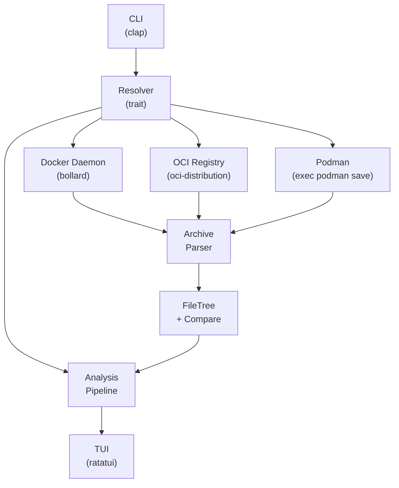
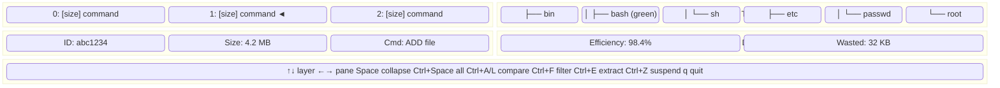
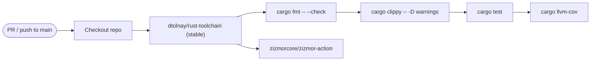

# deep-dive: Implementation Plan

A Rust rewrite of [dive](https://github.com/wagoodman/dive) — a tool for exploring
Docker/OCI image layer contents via a TUI.

## Why Rust?

- **Performance**: Image analysis involves parsing large tar archives, hashing file
  contents, and comparing trees. Rust's zero-cost abstractions and lack of GC make
  this fast and predictable.
- **Single binary**: No runtime dependency. Distribute a single statically-linked
  binary for each platform.
- **Safety**: The archive parser handles untrusted input (malicious images). Rust's
  memory safety eliminates an entire class of bugs.
- **Ecosystem**: ratatui (TUI), bollard (Docker API), oci-distribution (registry)
  are mature, well-maintained crates.

## Why Not Continue the Go Project?

The original dive is unmaintained and has core architectural issues (the TUI
framework `gocui` is unmaintained, the codebase mixes UI and business logic).
A rewrite lets us:
- Choose modern, maintained libraries (ratatui instead of gocui)
- Design a clean architecture from scratch
- Target macOS and Linux with native binaries via cargo-dist

## Architecture Overview



The pipeline is:

1. **CLI** parses arguments and determines the image source from the URI scheme
   (`docker://`, `docker-archive://`, `oci://`, `registry://`, `podman://`)
2. **Resolver** fetches the image from the source and produces an
   `Image` containing `Vec<Layer>`, where each `Layer` has a `FileTree`
3. **Analysis pipeline** runs the `Comparer` (stacking + diff-marking trees)
   and optionally the `Efficiency` scorer
4. **TUI** renders the layers, file tree, details, and efficiency data

## Key Design Decisions

### Resolver Trait

```rust
#[async_trait]
pub trait Resolver {
    async fn fetch(&self, image_ref: &str) -> Result<Image>;
    fn source_type(&self) -> ImageSource;
}
```

Each resolver implementation converts an image reference into a tar stream
(Docker save tar or OCI layout directory), which is then parsed by the
shared archive parser. This means all image sources share the same parsing
logic — only the fetching mechanism differs.

In Go terms, this matches dive's `engine_resolver.go` vs `archive_resolver.go`, but using a trait instead
of an interface.

### FileTree Data Structure

```rust
pub struct FileTree {
    root: FileNode,
}

pub struct FileNode {
    path: PathBuf,
    info: FileInfo,
    children: BTreeMap<String, FileNode>,
    diff_type: DiffType,
    collapsed: bool,
}

pub struct FileInfo {
    size: u64,
    mode: u32,
    uid: u32,
    gid: u32,
    type_flag: TarEntryType,  // file, dir, symlink, hardlink
    linkname: String,
    content_hash: u64,        // xxHash64 of file contents
}
```

- Uses `BTreeMap` for children (sorted iteration = free sorted output)
- Content hashing uses xxHash64 (fast, same as dive) for comparison
- Whiteout files (`.wh.<name>`) are handled at the `FileTree` level during
  stacking — they cause removal of the corresponding sibling node
- Opaque whiteout (`.wh..wh..opq`) causes removal of all children in a directory

### Comparer (Tree Comparison + Caching)

```rust
pub struct Comparer {
    cache: HashMap<CacheKey, FileTree>,
    layers: Vec<Layer>,
}

type CacheKey = (usize, usize, usize, usize);
// = (bottom_start, bottom_stop, top_start, top_stop)
```

- `StackTrees(upper, lower)`: Creates a new tree that is the upper tree merged
  onto the lower tree. Whiteout files in the upper tree cause removals.
- `CompareAndMark(lower, upper)`: Marks nodes in the lower tree with `DiffType`
  by comparing against the upper tree. Uses content hash for modification
  detection.
- Caching: Pre-computes all tree comparisons at startup so TUI navigation is
  instant. The cache key encodes which layer range we're comparing.
- Two indexing strategies (matching dive):
  - `NaturalIndexes`: Layer N vs layers 0..N-1 (shows what each layer changed)
  - `AggregatedIndexes`: All layers vs base layer 0 (shows total changes)

### Efficiency Algorithm

The efficiency score measures how much space is wasted by files appearing
in multiple layers (duplication) and files deleted in later layers.

```
efficiency = sum(min_size_across_layers_for_each_path)
           / sum(cumulative_size_across_layers_for_each_path)

wasted_bytes = sum(cumulative_sizes) - sum(min_sizes)
```

A score of 1.0 means no duplication or deletion — every file appears
exactly once. Lower scores indicate more wasted space.

Whiteout files add to the wasted byte total by recording the size of
the deleted file from the previous layer.

### Analysis Trait (Extensible Report Framework)

The efficiency algorithm is one of many possible analyses. To support
extensibility, all analyzers implement a common trait:

```rust
/// A single analysis that can be run against an image.
pub trait Analyzer {
    /// Human-readable name (e.g. "Efficiency", "Layer Stats").
    fn name(&self) -> &'static str;

    /// Brief description of what this analyzer does.
    fn description(&self) -> &'static str;

    /// Run the analysis against the image.
    fn analyze(&self, image: &Image) -> Result<Box<dyn AnalysisResult>>;
}

/// The result of running a single analyzer.
pub trait AnalysisResult {
    /// The analyzer name this result came from.
    fn analyzer_name(&self) -> &'static str;

    /// One-line summary for display in the TUI status bar.
    fn summary(&self) -> String;

    /// Detailed results — sections of labeled key-value pairs
    /// or structured data for the TUI details pane.
    fn details(&self) -> Vec<AnalysisSection>;
}

/// A labeled section within analysis results.
pub struct AnalysisSection {
    pub title: String,
    pub items: Vec<AnalysisItem>,
}

pub struct AnalysisItem {
    pub label: String,
    pub value: String,
}
```

A `Report` collects results from all registered analyzers:

```rust
pub struct Report {
    pub image_ref: String,
    pub results: Vec<Box<dyn AnalysisResult>>,
}

impl Report {
    /// Run all given analyzers against the image.
    pub fn generate(image: &Image, analyzers: &[Box<dyn Analyzer>]) -> Result<Self> {
        let results = analyzers
            .iter()
            .map(|a| a.analyze(image))
            .collect::<Result<Vec<_>>>()?;
        Ok(Self { image_ref: image.reference.clone(), results })
    }
}
```

**Why this design**:
- The `Analyzer` trait lets anyone add a new analysis by implementing
  one trait (plus its result type)
- `AnalysisResult` is trait-object-safe so results can be collected
  heterogeneously
- `AnalysisSection`/`AnalysisItem` provide a uniform way for the TUI
  to display results without knowing the concrete analyzer type
- New analyzers can be registered in the pipeline without changing
  existing code — just add to the `analyzers` vec

In the future this enables:
- A `deep-dive report <image>` CLI command that runs all analyzers
  and outputs a summary
- A report details pane in the TUI that lets the user scroll through
  each analyzer's results
- Exporting all analysis results as JSON

### TUI Architecture (ratatui + crossterm)

**UI approach**: Use ratatui's built-in widgets wherever possible. For
example, the layer list is a standard `ratatui::widgets::List`, the status
bar is a `Paragraph`, details panes use `Table` or `Paragraph` with block
titles. The file tree is the one custom widget (ratatui has no tree widget),
but even it can leverage `Paragraph` for rendering.

The goal is **functional parity** with dive — same keybindings, same
behavior — not pixel-perfect visual matching. If ratatui has a component
that works (e.g., `List` for layers, `Paragraph` for details), use it
as-is rather than building a custom equivalent.

The TUI uses an immediate-mode rendering loop (ratatui style):

```
loop {
    // 1. Handle input
    if let Event::Key(key) = event::read()? {
        state.handle_key(key);
    }

    // 2. Render
    terminal.draw(|f| {
        let layout = Layout::default()
            .direction(Direction::Horizontal)
            .constraints([Constraint::Percentage(30), Constraint::Percentage(70)])
            .split(f.area());

        // Left column: layers + details
        // Right column: file tree
        // Bottom: status bar
    })?;
}
```

State is managed in an `AppState` struct, not embedded in widgets:

```rust
pub struct AppState {
    pub selected_layer: usize,
    pub collapsed_paths: HashSet<String>,
    pub hidden_diff_types: EnumSet<DiffType>,
    pub sort_mode: SortMode,
    pub filter_regex: Option<Regex>,
    pub compare_mode: CompareMode,
    pub focus: FocusPane,
    pub show_attributes: bool,
}
```

## Project Structure

```
deep-dive/
├── Cargo.toml                  # Dependencies and metadata
├── rust-toolchain.toml         # Rust toolchain (stable)
├── renovate.json               # Renovate config for deps
├── .github/workflows/
│   ├── ci.yml                  # Test, fmt, clippy on PR/push
│   ├── release.yml             # cargo-dist release pipeline
│   ├── bump-version.yml        # Manual version bump workflow
│   └── renovate.yml            # Scheduled dependency updates
├── src/
│   ├── main.rs                 # async main, parse CLI, wire up pipeline
│   ├── lib.rs                  # Module declarations
│   ├── cli.rs                  # clap CLI argument parsing
│   ├── config.rs               # YAML config loading (Phase 9)
│   ├── image/
│   │   ├── mod.rs              # Image, Layer, Analysis structs
│   │   ├── resolver.rs         # Resolver trait, ImageSource, ArchiveFormat
│   │   ├── docker/
│   │   │   ├── mod.rs
│   │   │   ├── engine.rs       # bollard-based Docker daemon resolver
│   │   │   └── archive.rs      # Docker save tar file resolver
│   │   ├── oci/
│   │   │   ├── mod.rs
│   │   │   └── layout.rs       # OCI layout directory resolver (skopeo)
│   │   ├── registry.rs         # oci-client registry resolver
│   │   └── podman/
│   │       ├── mod.rs
│   │       └── resolver.rs     # podman image save shell-out
│   ├── analysis/
│   │   ├── mod.rs
│   │   ├── archive.rs          # Tar stream → Vec<Layer> with FileTrees
│   │   ├── filetree.rs         # FileTree, FileNode, DiffType
│   │   ├── comparer.rs         # Stack, CompareAndMark, caching
│   │   ├── report.rs           # Analyzer trait, Report collector
│   │   └── analyzers/
│   │       ├── mod.rs
│   │       ├── efficiency.rs   # Waste/duplication scoring
│   │       ├── layer_stats.rs  # Per-layer metrics (Phase 13)
│   │       └── shaded.rs       # Shaded file detection (Phase 14)
│   ├── tui/
│   │   ├── mod.rs
│   │   ├── app.rs              # Main loop + event handler
│   │   ├── state.rs            # AppState (selection, filters, modes)
│   │   ├── loader.rs           # Loading screen with progress
│   │   └── widgets/
│   │       ├── mod.rs
│   │       ├── layer_list.rs   # Ordered list of image layers
│   │       ├── file_tree.rs    # Color-coded ASCII file tree
│   │       ├── layer_details.rs # Layer metadata display
│   │       ├── image_details.rs # Efficiency + waste display
│   │       ├── status_bar.rs   # Keybinding hints
│   │       └── filter.rs       # Regex filter input
│   └── utils.rs                # Human-readable sizes, formatting
└── tests/
    └── fixtures/               # Sample images for testing
```

## Dependencies

### Production Dependencies

| Crate | Version | Purpose | Why This Crate |
|-------|---------|---------|----------------|
| `clap` | 4 | CLI argument parsing | Industry standard, derive API, auto-generated help |
| `ratatui` | 0.29 | TUI framework | Most popular Rust TUI, maintained fork of tui-rs |
| `crossterm` | 0.28 | Terminal handling | Cross-platform, works with ratatui, no ncurses dependency |
| `tokio` | 1 | Async runtime | Required for bollard + oci-distribution |
| `bollard` | 0.21 | Docker Engine API | De facto standard Rust Docker client (1.3k ★, 8yr old, 47 releases) |
| `oci-client` | 0.17 | OCI registry client | CNCF ORAS project, successor to oci-distribution (renamed at v0.12) |
| `oci-spec` | 0.10 | OCI image types | Containers org/youki-dev — manifest, config, descriptor types with serde (289 ★, Red Hat maintained) |
| `serde` | 1 | Serialization framework | Foundation for all JSON/YAML parsing |
| `serde_json` | 1 | JSON parsing | Manifest, config, (future) export |
| `serde_yaml` | 0.9 | YAML parsing | Config file loading |
| `flate2` | 1 | Gzip decompression | Layer decompression (most common format) |
| `zstd` | 0.13 | Zstd decompression | OCI layer decompression |
| `xxhash-rust` | 0.8 | xxHash64 | Fast content hashing for file comparison (292 ★, BSL-1.0, actively maintained) |
| `sha2` | 0.10 | SHA-256 | OCI digest verification |
| `tracing` | 0.1 | Logging facade | Structured logging, matches modern Rust patterns |
| `tracing-subscriber` | 0.3 | Logging sink | Env-filter, human-readable output |
| `anyhow` | 1 | Error handling | Flexible error type for application code |
| `thiserror` | 2 | Error derivation | Structured error types for libraries |
| `regex` | 1 | Regex filtering | File tree path filter |
| `bitflags` | 2 | Bitflag enums | DiffType visibility toggles |

### Dev Dependencies

| Crate | Version | Purpose |
|-------|---------|---------|
| `tempfile` | 3 | Temp directories in tests |
| `assert_fs` | 1 | Filesystem assertions in tests |
| `cargo-llvm-cov` | — | Code coverage measurement |

### Rationale for Key Choices

**ratatui over other TUI libraries**: ratatui is the de facto standard Rust TUI
library. It's immediate-mode (simpler state management), has a large widget
ecosystem, and is actively maintained. Alternative: `termion` (less capable,
no widget system). `iced` is a full GUI toolkit, not a TUI.

**bollard for Docker daemon access**: bollard is the de facto standard Rust
Docker client (1.3k stars, 178 forks, 47 releases, 8 years old, actively
maintained — last commit Jul 2026). It provides proper async streaming,
progress reporting, and typed API access. The dependency is declared in
Phase 0 but unused until Phase 5 when the Docker engine resolver is
implemented. No intermediate shell-out step is needed.

**oci-client for registry pulls**: This crate (formerly `oci-distribution`,
now under the CNCF ORAS project — 171 stars, 80 forks, 70+ contributors)
implements the OCI distribution spec. The alternative would be raw HTTPS
requests to registry v2 endpoints, but oci-client handles auth, retries,
and spec compliance. Use `oci-client = "0.17"` (the crate was renamed from
`oci-distribution` at v0.12).

**oci-spec for OCI types**: Under the `containers` org (youki-dev, 289 stars,
74 forks, maintained by Red Hat engineers). Provides serde-compatible types
for OCI image manifest, config, and distribution specs. Use `oci-spec = "0.10"`.

**xxHash64 over SHA-256 for file comparison**: Two options:
1. `xxhash-rust` (DoumanAsh, 292 stars, 25 forks, BSL-1.0 license,
   last commit Jul 2026, actively maintained). Single-maintainer project
   but the crate is a straightforward binding of the well-known xxHash C
   library (used by the original dive). Low risk.
2. **Alternative**: Use the `xxhash` crate (Cyan4973/xxHash official, as a
   C library with Rust bindings). Simpler dependency, avoids the
   single-maintainer concern.
   
Either way, xxHash64 is ~10x faster than SHA-256 for content hashing. We
only need a collision-resistant hash for file comparison, not cryptographic
guarantees. The original dive also uses xxHash64.

**BTreeMap over HashMap for tree children**: BTreeMap iterates in key order,
which means the file tree is naturally sorted alphabetically without a
separate sort pass. This is important for the TUI display.

## Implementation Phases

### Process Rules

These rules govern every phase of implementation:

1. **Tests required**: Every phase must include tests for all new functionality,
   and all tests must pass before the phase is considered complete.
2. **Git commit**: Each phase ends with a single git commit summarizing all
   changes. The commit message follows conventional commits style
   (`feat:`, `chore:`, `test:`, etc.) and describes what was built.
3. **No deferrals**: All work described in a phase must be completed within
   that phase. No feature, test, or required change may be deferred to a
   later phase without explicit human confirmation.
4. **Plan stability**: The plan document (`docs/plan.md`) must be kept up to
   date as the project evolves, but only the human may authorize changes.
   Agents must NOT modify the plan without explicit human instruction.
5. **Human gate**: After completing a phase (all tests pass, commit created),
   present a review to the human containing:
   - **What was done** — summary of all changes and features implemented
   - **Deviations** — anything not done to plan, with rationale
   - **Surprises** — anything unanticipated or that differed from the plan
     (unknowns discovered, design changes, etc.)
   - **Forward impacts** — anything that might affect later phases (e.g.,
     "the OCI layout parser revealed we need crate X, which wasn't in the
     dependency list")
   - **Test results** — count of passing / failing / skipped tests and
     test coverage percentage
   
   Then STOP. The human will review and either confirm the phase or
   request additional work before proceeding.

### Phase 0: Project Skeleton

**Goal**: `cargo build`, `cargo run -- --help` works. CI/CD infrastructure.

**Files to create**:
- `Cargo.toml` with all dependencies listed above, `license = "Apache-2.0"`
- `LICENSE` — Apache 2.0 (copy from ASF or use `cargo init --license`)`
- `rust-toolchain.toml`
- `.gitignore` (`/target`)
- `renovate.json`
- `.github/workflows/ci.yml`
- `.github/workflows/bump-version.yml`
- `.github/workflows/renovate.yml`
- `src/main.rs` — async main, parse CLI, dispatch
- `src/lib.rs` — `pub mod` declarations for all modules (empty)
- `src/cli.rs` — clap derive struct
- `AGENTS.md` — instructions for AI assistants working on this project

**CLI interface** (clap derive, standard help output):

```
deep-dive [OPTIONS] <IMAGE>

ARGS:
  <IMAGE>    Image reference as a URI (scheme://...)

OPTIONS:
  -c, --config <FILE>      Config file path
  -v, --verbose...         Verbose logging
  -q, --quiet              Quiet mode (errors only)
  -h, --help               Print help
  -V, --version            Print version
```

The image reference must always include a URI scheme. There is no `--source`
flag; the source is determined directly from the scheme. This keeps the CLI
simple and unambiguous.

Supported URI schemes:
- `docker://ubuntu:latest` → Docker daemon
- `docker-archive://path.tar` → Docker save tar file
- `oci://path/to/dir` → OCI layout directory (skopeo output)
- `registry://ubuntu:latest` → OCI registry
- `podman://ubuntu:latest` → Podman

Environment-variable overrides for flags/config are not supported.

**Design rationale**:
- All dependencies added upfront to avoid repeated rebuilds
- CI follows the same pattern as the calendar-proxy project:
  - `dtolnay/rust-toolchain` pinned by commit SHA
  - `cargo fmt -- --check`, `cargo clippy -- -D warnings`, `cargo test`
  - `zizmor` workflow for GitHub Actions security scanning
  - Renovate with `minimumReleaseAge: 7 days` to avoid pulling broken releases
  - cargo-dist for binary releases

---

### Phase 1: Archive Parser — Docker Save + OCI Layout

**Goal**: Parse both Docker save tar files and OCI layout directories into
`Vec<Layer>` where each layer has a `FileTree` of its files. Only gzip
compression for layers.

**Why this first**: Every resolver eventually produces an archive that needs
parsing. The archive parser is the foundation everything else depends on.
Adding OCI layout support here means `skopeo` users can analyze images
directly from `skopeo copy docker://... oci:dir` output.

**Files to create/modify**:
- `src/image/mod.rs` — `Image`, `Layer`, `Analysis` structs
- `src/image/resolver.rs` — `Resolver` trait, `ImageSource` enum, `ArchiveFormat`
- `src/image/docker/mod.rs` — module declarations
- `src/image/docker/archive.rs` — `DockerArchiveResolver` reads local tar file
- `src/image/oci/mod.rs` — module declarations
- `src/image/oci/layout.rs` — `OciLayoutResolver` reads OCI layout directory
- `src/analysis/mod.rs` — module declarations
- `src/analysis/archive.rs` — `parse_docker_save_tar()` + `parse_oci_layout()`
- `src/analysis/filetree.rs` — `FileTree`, `FileNode`, `FileInfo`, `DiffType`
- `src/utils.rs` — formatting helpers

**Archive parser logic** (`src/analysis/archive.rs`):

Two entry points, one shared layer-extraction core:

```rust
fn parse_docker_save_tar(reader: impl Read) -> Result<Image>
fn parse_oci_layout(path: &Path) -> Result<Image>
```

Both produce the same `Image` struct; the difference is how layer blobs
are located and read.

**Docker save tar format** (standard `docker save` / `skopeo copy --format docker-archive`):
```
manifest.json
  [{"Config":"<hash>.json","RepoTags":["tag1"],"Layers":["<hash1>/layer.tar",...]}]
<hash>.json          (image config: architecture, history, rootfs)
<hash1>/layer.tar    (layer filesystem, possibly gzipped)
<hash1>/json         (layer metadata)
<hash1>/VERSION      ("1.0")
<hash2>/layer.tar
...
repositories         (tag mapping, optional)
```

**OCI layout format** (standard `skopeo copy` / `podman save --format oci-dir`):
```
oci-layout
  {"imageLayoutVersion":"1.0.0"}
index.json
  {
    "schemaVersion":2,
    "manifests":[{"mediaType":"application/vnd.oci.image.manifest.v1+json","digest":"sha256:...","size":...}]
  }
blobs/sha256/
  <manifest-digest>     (OCI manifest: config + layer descriptors)
  <config-digest>       (image config: history, rootfs)
  <layer-digest-1>      (gzipped layer tar blob)
  <layer-digest-2>      (gzipped layer tar blob)
  ...
```

**Parsing flow for OCI layout**:
1. Read `oci-layout` to verify version 1.0.0
2. Read `index.json` to find available manifests
3. Pick the first manifest (or match on platform if specified)
4. Read the manifest JSON to get config digest + layer digests
5. Read the config blob to get `history[]` (layer commands)
6. For each layer descriptor in the manifest:
   a. Read blob at `blobs/sha256/<digest>` (always gzipped)
   b. Decompress with flate2
   c. Read each entry in the inner tar (same as Docker save flow)
   d. Build FileTree via `tree.add_path(path, file_info)`
7. Match history entries to non-empty layers (same as Docker save)
8. Return `Image { layers: Vec<Layer>, ... }`

**Key details** (shared by both formats):
- Layer commands come from the image config's `history[]` array.
  The `created_by` field contains the Dockerfile instruction, typically
  prefixed with `/bin/sh -c #(nop) ` or `/bin/sh -c ` — we strip these
  prefixes for display, matching dive's behavior.
- The first history entry is usually the base image (`FROM scratch` or
  `FROM busybox`). Its `empty_layer: true` means it has no tar layer.
- **Whiteouts**: Docker/OCI layers are stacked read-only filesystems, so
  deletions are represented as special marker files. Two types:
  - **File whiteout** (`.wh.<filename>`): hides `<filename>` from all lower
    layers. When stacking, layer 2's `.wh.config.xml` means the final view
    excludes `config.xml` even if it existed in layer 1.
  - **Opaque whiteout** (`.wh..wh..opq`): hides all children of the
    containing directory from lower layers. Used when a directory was
    replaced wholesale in an upper layer (e.g. a `RUN rm -rf /var/cache/*`
    followed by a fresh `apt-get install`).

**Auto-detection** (in the archive resolver or CLI):
- Path ends in `.tar` or `.tar.gz` → Docker save format
- Path is a directory containing `oci-layout` → OCI layout
- Explicit via URI scheme: `docker-archive://path` vs `oci://path`

Test fixtures (from the dive project's `.data/` directory):
- `test-docker-image.tar` (14 layers, whiteouts, various file types)
- `test-gzip-image.tar` (single layer, gzip)
- `test-uncompressed-image.tar` (single layer, no compression)

Additional OCI layout test fixtures should be created by converting
existing fixtures with `skopeo copy docker-archive:test-docker-image.tar oci:test-oci-layout`.

---

### Phase 2: FileTree + Compare Engine

**Goal**: Compare layers, produce diff-marked trees, display with ASCII
box-drawing.

**Files to create/modify**:
- `src/analysis/filetree.rs` — Add `compare_and_mark()`, `stack()`,
  `render_string_tree()`, sort, collapse
- `src/analysis/comparer.rs` — `Comparer` struct with caching

**FileTree operations**:

```rust
impl FileTree {
    /// Merge `upper` tree onto `self`, returning a new tree.
    /// Handles whiteout files (removes marked paths).
    fn stack(&self, upper: &FileTree) -> FileTree;

    /// Mark nodes in `self` with DiffType by comparing to `upper`.
    /// Nodes only in self → Removed
    /// Nodes only in upper → Added
    /// Nodes in both, different hash/metadata → Modified
    /// Nodes in both, same → Unmodified
    fn compare_and_mark(&mut self, upper: &FileTree);

    /// Render tree lines between start_row and stop_row.
    /// Uses Unicode box-drawing: ├── └── │
    /// Color-codes by DiffType.
    fn render_string_tree(&self, start_row: usize, stop_row: usize)
        -> Vec<&str>;

    fn collapse(&mut self, path: &str);
    fn expand(&mut self, path: &str);
    fn set_sort_mode(&mut self, mode: SortMode);
}
```

**Stack logic** (core algorithm):
1. Deep-copy the lower tree
2. For each node in the upper tree:
   - If it's a whiteout file (`.wh.<name>`), remove `<name>` from the copy
   - If it's an opaque whiteout (`.wh..wh..opq`), clear all children of
     the parent directory
   - Otherwise, upsert the node (adding new or overwriting existing)
3. Return the merged tree

This matches dive's `Stack()` function.

**CompareAndMark logic**:
1. Walk both trees in parallel
2. For each path:
   - In lower only → mark lower as `Removed`
   - In upper only → mark as `Added`
   - In both, content_hash differs → mark as `Modified`
   - In both, same → mark as `Unmodified`
3. Also consider metadata (size, mode, uid/gid) for modification detection

This matches dive's `CompareAndMark()` function.

**Comparer caching**:

```rust
pub struct Comparer {
    layers: Vec<Layer>,
    cache: HashMap<(usize, usize, usize, usize), FileTree>,
    // (bottom_start, bottom_stop, top_start, top_stop)
}

impl Comparer {
    pub fn new(layers: Vec<Layer>) -> Self;

    /// Natural: each layer vs all previous
    /// Returns [(bottom=0..0, top=1), (bottom=0..1, top=2), ...]
    pub fn natural_indexes(&self) -> Vec<(usize, usize, usize, usize)>;

    /// Aggregated: each layer vs base (layer 0)
    /// Returns [(bottom=0..0, top=0..1), (bottom=0..0, top=0..2), ...]
    pub fn aggregated_indexes(&self) -> Vec<(usize, usize, usize, usize)>;

    /// Get cached tree for a layer range, computing if needed
    pub fn get_tree(&mut self, bottom_start, bottom_stop, top_start, top_stop)
        -> &FileTree;

    /// Pre-compute all trees for natural indexes
    pub fn build_cache(&mut self);
}
```

**Tree rendering**:
The `render_string_tree` function generates lines like:
```
├── bin
│   ├── bash
│   ├── ls
│   └── sh
├── etc
│   ├── passwd
│   └── resolv.conf
└── root
    └── somefile.txt
```

Each line is a `String`. The function takes a start/stop row for viewport-based
rendering (we only render the visible portion of the tree).

Color coding (when rendered to terminal):
- `Added` → Green
- `Removed` → Red
- `Modified` → Yellow
- `Unmodified` → Default foreground

---

### Phase 3: Minimal TUI

**Goal**: A working two-pane TUI. Left side shows layers, right side shows
file tree. Up/down to select layer. Enter/space to collapse directories. q to quit.

**Why this minimal**: We want to validate the end-to-end pipeline ASAP. A
2-pane TUI is the fastest way to see if the archive parser and comparer are
working correctly.

**Files to create**:
- `src/tui/mod.rs`
- `src/tui/app.rs` — Main loop, ratatui setup, event handling
- `src/tui/state.rs` — `AppState`
- `src/tui/widgets/mod.rs`
- `src/tui/widgets/layer_list.rs` — Layer list widget
- `src/tui/widgets/file_tree.rs` — File tree widget

**TUI layout**:

```mermaid
block-beta
    columns 2
    block:Layers["Layers"]:1
        texts("0: [0 B] FROM scratch")
        texts2("1: [4.2 MB] ADD ...")
        texts3("2: [1.2 KB] COPY ...")
        texts4("3: [45 B] RUN ...")
    end
    block:FileTree["File Tree"]:1
        texts5("├── bin")
        texts6("│   ├── bash")
        texts7("│   └── sh")
        texts8("├── etc")
        texts9("│   ├── passwd")
        texts10("│   └── resolv.conf")
        texts11("└── root")
        texts12("    └── somefile.txt  (green)")
    end
    block:Status["Status"]:2
        texts13("↑↓ layer  Enter collapse  q quit")
    end
```



**State** (`src/tui/state.rs`):
```rust
pub struct AppState {
    pub layers: Vec<LayerData>,         // data from analysis
    pub selected_layer: usize,
    pub collapsed_paths: HashSet<String>,
    pub hidden_diff_types: EnumSet<DiffType>,  // all visible initially
    pub sort_mode: SortMode,            // default: Name
    pub compare_mode: CompareMode,      // default: Natural
    pub focus: FocusPane,               // default: LayerList
    pub show_attributes: bool,          // default: false
    pub filter_text: String,
    pub is_filter_active: bool,
}
```

**Event handling** (MVP — only essential keys):
- `Up` / `k` → select previous layer
- `Down` / `j` → select next layer
- `Enter` / `Space` → toggle collapse on selected file tree node
- `q` / `Ctrl+C` → quit
- Resize → automatically handled by ratatui

**App main loop** (`src/tui/app.rs`):
```rust
pub async fn run(image: Image) -> Result<()> {
    let mut terminal = ratatui::init();
    let mut state = AppState::new(image);
    let result = run_app(&mut terminal, &mut state).await;
    ratatui::restore();
    result
}

async fn run_app(terminal: &mut Terminal<impl Backend>, state: &mut AppState) -> Result<()> {
    loop {
        terminal.draw(|f| ui(f, state))?;

        if let Event::Key(key) = event::read()? {
            match key.code {
                KeyCode::Char('q') | KeyCode::Ctrl('c') => break,
                KeyCode::Up | KeyCode::Char('k') => state.select_prev_layer(),
                KeyCode::Down | KeyCode::Char('j') => state.select_next_layer(),
                KeyCode::Enter | KeyCode::Char(' ') => state.toggle_collapse(),
                _ => {}
            }
        }
    }
    Ok(())
}
```

**LayerList widget**:
- Standard `ratatui::widgets::List` — simple vertical list showing each layer
  with index, size, and command
- Selected layer is highlighted with ratatui's built-in `ListState`
- Empty layers (FROM scratch) show `[0 B]`

**FileTree widget**:
- Custom rendering via `Paragraph` with the tree string as content
- Gets the tree from `Comparer::get_tree(natural_index(state.selected_layer))`
- Applies collapsed_paths filter
- Renders only the visible portion (viewport-aware)
- Color-coded by DiffType using ratatui `Span` styling

**Keybinding bar** (bottom):
- Simple `Paragraph` with available actions based on current context

---

### Phase 4: Integration — MVP v0.1.0

**Goal**: Wire everything together. `deep-dive docker-archive://path/to/image.tar` works end-to-end.

**Changes**:
- `src/main.rs` wires CLI → resolver → archive parser → comparer → TUI
- Handle errors gracefully (bad path, invalid tar, etc.)
- Add spinner/loading indicator during archive parsing
- cargo-dist setup for releasing binaries

**cargo-dist setup**:
```
cargo dist init
  # Targets: aarch64-apple-darwin, x86_64-apple-darwin,
  #          aarch64-unknown-linux-gnu, x86_64-unknown-linux-gnu
  # This generates .github/workflows/release.yml
```

**Release workflow** (generated by cargo-dist):
```
On push to main:
  1. Build for all 4 targets (cross-compile where needed)
  2. Compute version from Cargo.toml
  3. Create/update draft GitHub Release with binaries + checksums
  4. Include install script, Homebrew formula (optional)
```

**At this point**: `deep-dive is USABLE`. You can analyze any Docker save tar.

---

### Phase 5: Docker Daemon Resolver

**Goal**: `deep-dive ubuntu:latest` pulls from local Docker daemon.

**Implementation**:
1. Connect to Docker daemon via bollard (Unix socket or DOCKER_HOST)
2. Check if image exists via `ImageInspect`
3. If not found, run `docker pull <image>` (or use bollard's pull API)
4. Export image via `ImageSave` → stream tar → archive parser
5. Show progress during pull and export

**Key details**:
- Docker socket path: `unix:///var/run/docker.sock` (Linux/macOS)
- Fall back to `DOCKER_HOST` env var, then Docker context
- Pull progress: bollard provides `ImageCreateProgress` events
- Export progress: monitor bytes from the tar stream

**Tests**: Conditional on Docker being available.

---

### Phase 6: OCI Layout + Zstd Support

**Goal**: Parse OCI layout format images and zstd-compressed layers.

**OCI layout format**:
```
oci-layout           → {"imageLayoutVersion": "1.0.0"}
index.json           → {"schemaVersion":2,"manifests":[{...}]}
blobs/sha256/<hash>  → manifest JSON
blobs/sha256/<hash>  → config JSON
blobs/sha256/<hash>  → layer blob (gzip, zstd, or uncompressed tar)
```

Detection: Check for `oci-layout` file or `blobs/` directory in tar.

**Zstd decompression**:
- Read first few bytes to detect compression format
- Try gzip → zstd → uncompressed (content sniffing)
- Reuse the same per-layer tar processing logic

---

### Phase 7: Full FileTree Features

**Goal**: Feature-complete file tree matching dive.

Add:
- Collapse all / expand all (`Ctrl+Space`)
- Sort by name or size (`Ctrl+O`)
- Show file attributes (permissions, uid:gid, size) (`Ctrl+B`)
- Toggle visibility by DiffType (`Ctrl+A` / `Ctrl+R` / `Ctrl+M` / `Ctrl+U`)
- Regex filter (`Ctrl+F`) with `Esc` to close
- Page up / page down (`PgUp`/`PgDn` or `u`/`d`)
- Aggregated compare mode (`Ctrl+A`)
- Single-layer compare mode (`Ctrl+L`)
- Wrap tree toggle (`Ctrl+P`)
- Extract selected file (`Ctrl+E`)

**Filter implementation**:
- `Ctrl+F` toggles filter mode (focus shifts to filter input)
- Type regex pattern → file tree is filtered in real-time
- `Esc` exits filter mode
- Visual indicator when filter is active

---

### Phase 8: Analyzer Framework + Efficiency Analyzer

**Goal**: Implement the `Analyzer` trait and `Report` collector. Build the
efficiency analyzer as the first concrete implementation. Display results
in the TUI.

**Files to create/modify**:
- `src/analysis/report.rs` — NEW: `Analyzer` trait, `AnalysisResult` trait,
  `Report` collector, `AnalysisSection`, `AnalysisItem`
- `src/analysis/analyzers/mod.rs` — NEW: module declarations
- `src/analysis/analyzers/efficiency.rs` — NEW: efficiency analyzer
- `src/tui/widgets/image_details.rs` — NEW: report display pane

**Analyzer trait** (defined in `report.rs`):
```rust
pub trait Analyzer: Send + Sync {
    fn name(&self) -> &'static str;
    fn description(&self) -> &'static str;
    fn analyze(&self, image: &Image) -> Result<Box<dyn AnalysisResult>>;
}

pub trait AnalysisResult: Send + Sync {
    fn analyzer_name(&self) -> &'static str;
    fn summary(&self) -> String;
    fn details(&self) -> Vec<AnalysisSection>;
}

pub struct AnalysisSection {
    pub title: String,
    pub items: Vec<AnalysisItem>,
}

pub struct AnalysisItem {
    pub label: String,
    pub value: String,
}

pub struct Report {
    pub image_ref: String,
    pub results: Vec<Box<dyn AnalysisResult>>,
}

impl Report {
    pub fn generate(image: &Image, analyzers: &[Box<dyn Analyzer>]) -> Result<Self>;
}
```

**Efficiency analyzer** (reproducing dive's logic in `analyzers/efficiency.rs`):

```rust
pub struct EfficiencyAnalyzer;

impl Analyzer for EfficiencyAnalyzer {
    fn name(&self) -> &'static str { "Efficiency" }
    fn description(&self) -> &'static str {
        "Measures space wasted by file duplication across layers"
    }
    fn analyze(&self, image: &Image) -> Result<Box<dyn AnalysisResult>> { /* ... */ }
}

pub struct EfficiencyResult {
    pub score: f64,
    pub total_bytes: u64,
    pub user_bytes: u64,
    pub wasted_bytes: u64,
    pub wasted_user_percent: f64,
    pub inefficiencies: Vec<Inefficiency>,
}

pub struct Inefficiency {
    pub path: String,
    pub cumulative_size: u64,
    pub wasted_bytes: u64,
}
```

**Efficiency algorithm**:
1. For each leaf node (file) across all layers:
   - Track `cumulative_size` (sum of sizes across all layers containing it)
   - Track `min_size` (smallest occurrence size)
2. A file is "inefficient" if it appears in >= 2 layers (same path duplicated)
3. Whiteout files represent deleted files — their waste is the size of
   the deleted file from the previous layer
4. `efficiency = sum(min_sizes) / sum(cumulative_sizes)`
5. `wasted_bytes = sum(cumulative_sizes) - sum(min_sizes)`

**Pipeline integration**:
```rust
// In main.rs or app setup:
let analyzers: Vec<Box<dyn Analyzer>> = vec![
    Box::new(EfficiencyAnalyzer),
    // Later: Box::new(LayerStatsAnalyzer),
    // Later: Box::new(ShadedFileAnalyzer),
];
let report = Report::generate(&image, &analyzers)?;
```

**Report display widget** (`ImageDetails` or a generic `ReportPane`):
- Shows each analyzer's summary line
- User can select an analyzer to see its detailed sections
- For efficiency: shows image name, total size, efficiency %,
  wasted space, top 10 inefficient files
- Framework allows any future analyzer's results to render
  automatically via the `AnalysisSection`/`AnalysisItem` types

**Tests**:
- Unit test: `EfficiencyAnalyzer` on `test-docker-image.tar` matches
  dive's known values (efficiency ≈ 0.984, wasted ≈ 32 KB)
- Unit test: `Report::generate` with empty analyzers returns empty report
- Unit test: custom mock analyzer produces correct section format

---

### Phase 9: Full TUI — All Panes

**Goal**: Feature-complete TUI matching dive.

**Final layout**:



**Additional widgets**:
- `LayerDetails`: Shows layer ID, size, command, digest, tags
- `Filter`: Editable input, regex filtering
- Status bar becomes context-sensitive

**Focus management**:
- `Tab` cycles focus between panes: LayerList → FileTree → Filter (if active) → LayerList
- `Left` / `Right` (or `h` / `l`) cycle focus within the left column:
  Layers → Layer Details → Image Details → Layers
- `Left` / `Right` also navigate the file tree (parent / expand) when the file tree is focused
- Focused pane has visual indicator (highlighted border or cursor)
- Keybindings dispatch to focused pane
- `Ctrl+Z` suspends the process to the shell on Unix (`SIGTSTP`), resuming on `fg`; no-op on Windows

**Config loading** (`src/config.rs`):
- Search paths: `./deep-dive.yaml`, `~/.config/deep-dive/config.yaml`
- YAML format matching dive's config structure
- Keybinding overrides, display defaults

---

### Phase 10: OCI Registry Resolver

**Goal**: `deep-dive registry://alpine:latest` pulls directly from registry.

**Implementation**:
1. Parse image reference (registry host, repository, tag/digest)
2. Load Docker config (`~/.docker/config.json`) for credentials
3. Support credential helpers (`docker-credential-*`)
4. Connect to registry via oci-distribution
5. Fetch manifest (and resolve manifest list for native platform)
6. Fetch config blob for history
7. Stream and decompress layer blobs, building FileTrees

**Auth flow**:
1. Check if registry requires auth (401 response)
2. Parse `Www-Authenticate` header for realm/service/scope
3. Get token: try Docker config, then credential helpers, then anonymous
4. Retry requests with Bearer token

**Tests**:
- `alpine:latest` from Docker Hub (conditional: network required)
- Recorded responses for offline testing

---

### Phase 11: Podman Resolver

**Goal**: `deep-dive podman://fedora:latest` works with Podman.

**Implementation**:
1. Shell out to `podman image save <image>` via `tokio::process::Command`
2. Pipe stdout into the archive parser
3. If image not found, run `podman pull <image>` first
4. Platform-gated: `cfg(target_os = "linux" || target_os = "macos")`

**Why shell out instead of API**: Podman's API is Docker-compatible but
requires the Podman socket to be enabled (not default). Shelling out to
`podman image save` works on any Podman installation with no setup.

---

### Phase 12: v1.0 Release

**Goal**: Production-ready release.

**Tasks**:
1. cargo-dist final configuration
2. README with install instructions, usage, keybinding reference, screenshots
3. LICENSE (Apache 2.0 or user's choice)
4. Performance testing with 200+ layer image
5. Final 80% test coverage verification
6. v1.0 release

---

### Phase 13: Layer Stats Analyzer

**Goal**: Add a `LayerStatsAnalyzer` that computes per-layer metrics and
displays them in the report pane.

**Rationale**: Layer-level statistics help users understand where space is
going and how effective each Dockerfile instruction is. This is the first
"new" analyzer beyond what dive offered, demonstrating the extensibility
of the `Analyzer` trait.

**Files to create/modify**:
- `src/analysis/analyzers/layer_stats.rs` — NEW: analyzer implementation
- `src/analysis/analyzers/mod.rs` — register the new module
- `src/main.rs` or app setup — add `LayerStatsAnalyzer` to the analyzers vec

**Metrics per layer**:

| Metric | How It's Computed |
|--------|-------------------|
| **Layer size** | Sum of `FileInfo.size` for all regular files in the layer's tar |
| **Unique size** | Size of files in this layer that don't appear in any previous layer |
| **Wasted size** | Size of files in this layer that DO appear in a previous layer (duplicates) |
| **Compressed size** | Size of the layer's compressed blob in the archive (known exactly for `docker-archive://` and `oci://` sources; otherwise estimated via gzip ratio) |
| **Compression ratio** | `compressed_size / raw_size` |
| **File count** | Number of regular files in the layer |
| **Directory count** | Number of directories created/modified |
| **Symlink count** | Number of symlinks |
| **Percent of image** | `layer.unique_size / image.total_user_size * 100` |
| **Cumulative percent** | Running total of unique size percent (Pareto analysis) |
| **Command** | The Dockerfile instruction that created this layer |
| **Whiteout count** | Number of whiteout files (deletions) in this layer |
| **Whiteout bytes** | Total size of files deleted by whiteouts in this layer |

```rust
pub struct LayerStatsAnalyzer;

impl Analyzer for LayerStatsAnalyzer {
    fn name(&self) -> &'static str { "Layer Stats" }
    fn description(&self) -> &'static str {
        "Per-layer metrics: size, compression, file counts"
    }
    fn analyze(&self, image: &Image) -> Result<Box<dyn AnalysisResult>> { /* ... */ }
}

pub struct LayerStatsResult {
    pub layers: Vec<LayerStats>,
}

pub struct LayerStats {
    pub index: usize,
    pub command: String,
    pub raw_size: u64,
    pub unique_size: u64,
    pub wasted_size: u64,
    pub compressed_size: Option<u64>,
    pub compression_ratio: Option<f64>,
    pub file_count: usize,
    pub dir_count: usize,
    pub symlink_count: usize,
    pub percent_of_image: f64,
    pub cumulative_percent: f64,
    pub whiteout_count: usize,
    pub whiteout_bytes: u64,
}
```

**Algorithm notes**:
- `unique_size` and `wasted_size` require tracking which paths appeared
  in previous layers (reuse the path tracking from the comparer)
- `compressed_size` is only available when parsing from a tar archive
  where the original blob size is known. For Docker daemon and registry
  sources, estimate by compressing the raw layer data with gzip and
  measuring the output
- `percent_of_image` is computed against `user_size` (total minus base),
  matching dive's convention

**TUI display**: The report pane shows a table of layers with these
metrics. User can scroll horizontally to see all columns. Key columns
(layer size, unique size, percent) are shown in the summary view.

**Tests**:
- `LayerStatsAnalyzer` on `test-docker-image.tar` produces correct
  per-layer sizes matching known values
- `unique_size + wasted_size == raw_size` for each layer
- Cumulative percent sums to ~100% for the final layer
- Whiteout counts match known whiteout layers

---

### Phase 14: Shaded File Analyzer

**Goal**: Add a `ShadedFileAnalyzer` that detects files at the same path
across multiple layers — a situation where the upper layer's copy
completely hides (shades) the lower layer's copy.

**Rationale**: Shaded files are a form of waste that the efficiency
analyzer already catches (they contribute to duplicate file waste).
However, the shaded file analyzer provides a focused view: *which* files
are shaded and *where* they came from. This helps users identify
unintentional file overwrites, copy-paste errors in Dockerfiles, or
inefficient multi-stage builds that leave debris.

**What is a shaded file?** When two layers both contain the same path
(e.g., `/usr/bin/app` in layer 3 and layer 7), the file in layer 3 is
"shaded" — it exists in the image but is never visible because layer 7's
version always wins at runtime. The lower layer's bytes are pure waste.

Shaded files are distinct from whiteout-deleted files:
- Whiteout: the layer explicitly removes the file (`rm file`)
- Shaded: the layer overwrites the file (`COPY file`) — the old copy
  still occupies space in a lower layer

```rust
pub struct ShadedFileAnalyzer;

impl Analyzer for ShadedFileAnalyzer {
    fn name(&self) -> &'static str { "Shaded Files" }
    fn description(&self) -> &'static str {
        "Files whose content is hidden by a newer version in a higher layer"
    }
    fn analyze(&self, image: &Image) -> Result<Box<dyn AnalysisResult>> { /* ... */ }
}

pub struct ShadedFileResult {
    pub shaded_files: Vec<ShadedFile>,
    pub total_shaded_bytes: u64,
    pub shaded_file_count: usize,
}

pub struct ShadedFile {
    pub path: String,
    /// The layers where this file appears (ordered bottom to top).
    pub occurrences: Vec<ShadedOccurrence>,
}

pub struct ShadedOccurrence {
    pub layer_index: usize,
    pub size: u64,
    pub content_hash: u64,
    /// True if this occurrence is hidden by a higher layer.
    pub is_shaded: bool,
}
```

**Detection algorithm**:
1. Walk every leaf file path across all layers
2. For each path, collect the list of layers that contain it
3. If a path appears in >= 2 layers, and the *highest* layer's copy
   is not a whiteout deletion:
   - All lower copies are "shaded" — mark `is_shaded = true`
   - The highest copy is "visible" — mark `is_shaded = false`
4. Special case: if the highest occurrence is a whiteout file, then
   the path is deleted entirely — all lower occurrences are still shaded
   (the bytes still exist in the layer tars), but the runtime effect is
   deletion. Include a flag `deleted_by_whiteout: bool`.

Contrast with the efficiency analyzer:
- Efficiency: aggregates waste globally, reports a single score
- Shaded File: enumerates every shaded path, its layers, and sizes.
  A file counted as "inefficient" by efficiency might be shaded here.

**TUI display**:

A shaded files section in the report pane:
```
Shaded Files ──────────────────────────────────────
Total shaded: 4 files, 128 KB wasted

/usr/bin/app
  Layer 3: 45 KB (shaded by layer 7)
  Layer 7: 52 KB ← visible

/etc/config.yml
  Layer 2: 1.2 KB (shaded by layer 5)
  Layer 5: 1.2 KB ← visible

/root/.secret
  Layer 4: 80 KB (shaded by layer 6)
  Layer 6: 80 KB ← visible
  (content identical — same hash)
```

Sort by wasted bytes descending by default. Show identical-content
shading vs changed-content shading.

**Tests**:
- `ShadedFileAnalyzer` on `test-docker-image.tar` — verify known
  shaded paths (e.g., `/root/example/somefile1.txt` exists in layers
  4 and 5; layer 5's copy shades layer 4's)
- Synthetic test: 3 layers with known shading pattern
- Edge case: file that is shaded then later whited-out
- Edge case: file with identical content in all layers (zero waste
  but still shaded — the efficiency analyzer would give this a pass
  since min_size == cumulative_size, but shaded file detection finds
  it because the path still appears redundantly)

---

### Target: 80% line coverage

### Test Levels

**Unit tests**: Inline `#[cfg(test)] mod tests` in every source file.
- FileTree: add_path, get_node, whiteout handling, render_string_tree, sort
- Archive parser: parse valid/invalid tars, compression detection
- Comparer: stack, compare_and_mark, caching, natural/aggregated indexes
- Efficiency: score computation, whiteout tracking
- CLI: argument parsing, URI detection
- State: state transitions, filter logic

**Integration tests**: In `tests/` directory.
- Full pipeline: fixture tar → parse → compare → analyze
- Use `test-docker-image.tar` from dive's `.data/` directory
- Verify exact match with dive's known output values

**Conditional tests**:
- Docker resolver: only if `DOCKER_HOST` or `/var/run/docker.sock` exists
- Podman resolver: only if `podman --version` succeeds
- Registry resolver: only if network available (marked `#[ignore]` by default)

### Test Fixtures

### Test Fixtures

Test fixtures are copied from the dive project's `.data/` directory into
`tests/fixtures/` as part of the initial project setup (Phase 0-1). These
files are committed to the repository so they're available in CI without
depending on the dive source directory.

| Fixture | Purpose |
|---------|---------|
| `test-docker-image.tar` | Primary: 14 layers, whiteouts, mixed file types |
| `test-gzip-image.tar` | Single layer, gzip compressed |
| `test-uncompressed-image.tar` | Single layer, no compression |
| `test-zstd-image.tar` | Single layer, zstd (Phase 6) |
| `test-oci-gzip-image.tar` | OCI format, gzip (Phase 6) |
| `test-oci-zstd-image.tar` | OCI format, zstd (Phase 6) |

### Coverage Measurement

```bash
cargo install cargo-llvm-cov
cargo llvm-cov --lcov --output-path lcov.info
```

CI: Run coverage on every PR, gate on >= 80% or just report.

---

## CI/CD Pipeline

### Workflows

**`ci.yml`** — Runs on PR + push to main:



**`release.yml`** — Generated by cargo-dist. Releases on tag or push:
- Builds for 4 targets (macOS x86_64 + aarch64, Linux x86_64 + aarch64)
- Creates GitHub release with binaries + checksums

**`bump-version.yml`** — Manual workflow_dispatch:
- Validates semver
- sed Cargo.toml
- Creates PR with auto-merge

**`renovate.yml`** — Scheduled (daily):
- Self-hosted Renovate for dependency updates
- Groups Rust deps, auto-merges minor/patch after 7 days

### Renovate Config

```json
{
  "extends": ["config:recommended", "helpers:pinGitHubActionDigests"],
  "minimumReleaseAge": "7 days",
  "labels": ["dependencies"],
  "enabledManagers": ["cargo", "github-actions"],
  "packageRules": [
    {
      "matchManagers": ["cargo"],
      "matchUpdateTypes": ["minor", "patch"],
      "groupName": "Rust dependencies (minor/patch)",
      "automerge": true
    },
    {
      "matchManagers": ["github-actions"],
      "groupName": "GitHub Actions"
    }
  ]
}
```

---

## Key Algorithm: File Tree Stacking

This is the most algorithmically complex part. Here's the detailed logic:

```
Input: lower_tree (FileTree of previous layers)
       upper_tree (FileTree of the current layer)

Output: merged_tree (upper stacked onto lower)

Algorithm:
1. merged = deep_copy(lower_tree)
2. Walk upper_tree depth-first
3. For each node in upper_tree:
   a. If filename starts with ".wh.":
      - Actual name = filename[4:] (strip ".wh." prefix)
      - Remove "actual_name" from merged at the same directory level
      - If actual_name is ".wh..opq" (opaque whiteout):
        - Remove ALL children from the parent directory in merged
   b. Otherwise:
      - Upsert the node into merged (add if new, overwrite if exists)
4. Return merged
```

## Key Algorithm: Compare and Mark

```
Input: lower_tree (stacked tree of previous layers)
       upper_tree (stacked tree including current layer)

Output: lower_tree with DiffType marks

Algorithm:
1. Walk both trees in parallel (same path traversal)
2. For each path:
   a. Exists in upper, NOT in lower → mark upper node as Added
   b. Exists in lower, NOT in upper → mark lower node as Removed
   c. Exists in both:
      - If content_hash differs → mark as Modified
      - If size, mode, uid, or gid changed → mark as Modified
      - Otherwise → mark as Unmodified
3. Return marked tree
```

## Key Algorithm: Efficiency Scoring

```
Input: All layer trees (0..N)

Algorithm:
1. Initialize tracking maps:
   - cumulative_size: path → total bytes across all layers
   - min_size: path → minimum size seen in any single layer
2. Walk each layer's leaf nodes:
   - cumulative_size[path] += file.size
   - min_size[path] = min(min_size.get(path, INF), file.size)
3. Handle whiteouts:
   - For each whiteout file, the deleted file's size from the
     previous layer is added to wasted_bytes
4. Compute:
   efficiency = sum(min_size.values()) / sum(cumulative_size.values())
   wasted_bytes = sum(cumulative_size.values()) - sum(min_size.values())
5. Sort inefficiencies by (cumulative_size - min_size) descending
6. Return EfficiencyResult
```

## FAQ

### Why not use ParseKit or another parsing library?

The Docker save tar format is straightforward enough that a custom parser
is simpler than integrating a parsing framework. The complexity is in the
whiteout handling and compression detection, not the tar format itself.

### Why `#[async_trait]` on the Resolver trait?

The resolver trait's `fetch()` method is async (network calls for Docker
daemon and registry). Rust doesn't support async methods in traits without
`#[async_trait]` or AFIT (Async Functions in Traits, stabilized in Rust
1.75+). Since we target stable, we'll use `#[async_trait]`.

### Why two compare modes (Natural vs Aggregated)?

- **Natural**: Shows what each individual layer changed. Useful for
  understanding a Dockerfile layer by layer. Each view compares layer N
  against all previous layers (0..N-1).
- **Aggregated**: Shows cumulative changes from the base image.
  Each view compares all layers up to N against just layer 0 (the base).
  Useful for seeing "what's in the image vs what's in the base image."

Both are inherited from dive and serve different use cases.

### Why copy test fixtures instead of symlinking?

The dive project's `.data/` directory contains the original fixture files.
We copy them rather than symlink so that tests run independently of the
dive source directory. The fixtures are small (~1.5 MB for the main
fixture) and are committed directly into `tests/fixtures/`.
